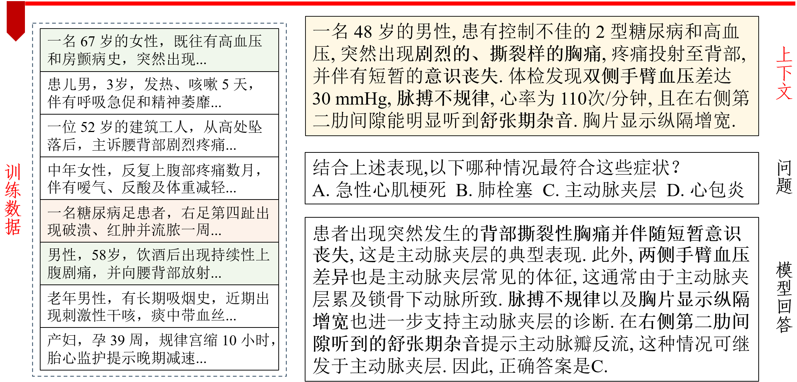
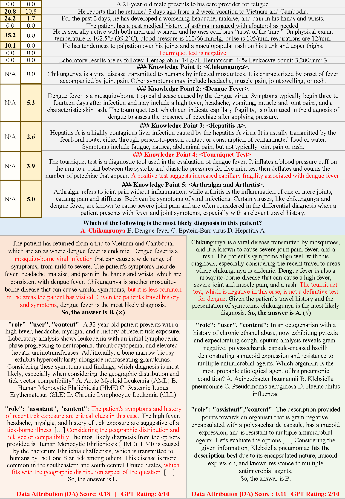

# DCA 系统: 使用说明和效果反馈
本文档为 DCA 系统 (Data and Context Attribution System) 的使用说明文档, 亦包含系统应用效果的定性反馈, 作为复旦大学 "人工智能的伦理与治理" (DATA130055.01; 2025 年春季) 课程期末设计的一部分. 关于 DCA 系统完整的项目背景, 需求分析, 实现设计等内容, 请参照最终提交的论文正文.

## 1. 系统整体概述

  

DCA 系统的整体目的是: 对于大语言模型 (LLMs) 生成的临床诊断内容, 我们既希望将其归因 (attribute) 于**上下文 (context) 中所提供的病人病情描述**, 也希望将其归因到**在知识运用或逻辑推理上对模型产生特定引导作用的训练样本 (training examples)**. 这样一个指向训练数据 ("data") 和上下文 ("context") 的同步归因系统, 可以帮助临床医疗从业者了解大模型做出临床诊断的依据, 一方面提高了模型生成内容的**可解释性 (interpretability) 和透明度 (transparency)**; 另一方面也能通过针对性地溯源归因得到的训练数据或上下文, 及时地发现基于错误数据的模型生成内容, 从而高效地修正错误, 减少临床诊疗的误诊率. 因此, DCA 系统也是对大语言模型在训练和推理阶段的**数据伦理**的重要增强手段.

  

DCA 系统共包含三个技术组件: (1) 训练数据归因模块 (源码包含在 `./less/` 文件夹内) (2) 上下文归因模块 (源码包含在 `./context_cite/` 文件夹内). (3) 同步并行进行训练数据和上下文归因的高效框架 (源码包含在 `./medqa/` 文件夹内). 下面本文档将分别说明这三个技术组件的运行与使用方式.

特别地, 在运行 DCA 系统的 Python 和 Shell 脚本之前, 请先参考 `./less-requirements.txt` 和 `./contextcite-requirements.txt` 进行环境配置. 之后, 请参考 `./utils_download_models_datasets` 文件夹内的脚本下载所需的大语言模型和训练、测试数据. 本代码仓库所使用的默认模型是 Meta 公司开发的 [Llama-3.1-8B](https://huggingface.co/meta-llama/Llama-3.1-8B); 默认训练数据集是清华大学自然语言处理实验室推出的 [UltraMedical 数据集](https://huggingface.co/datasets/TsinghuaC3I/UltraMedical); 默认测试数据集是 [MedQA-USMLE](https://huggingface.co/datasets/GBaker/MedQA-USMLE-4-options) 临床诊断问答数据集, 其题型为历年美国医师执业资格考试 (USMLE) 的四选项选择题.

## 2. 训练数据归因 (Data Attribution) 模块

训练数据的归因模块基于 Princeton 自然语言处理实验室研发的 [LESS 技术](https://github.com/princeton-nlp/LESS). 我们基于其数学原理, 将其从 "训练模型时的数据选择方法" 改造为 "模型推理时实时的训练数据归因方法". 其 Python 源码包含于 `./less/` 文件夹内. 想要运行 DCA 系统的训练数据归因模块, 请参照 `./scripts_LESS_UM-llama3.1` 文件夹内的 Shell 脚本, 从 step1 按顺序运行至 step3_2 即可. 特别地, 我们在 `./scripts_LESS_UM-llama3.1-logs` 文件夹内也提供了这些 Shell 脚本正确运行的情况下所应输出的 log 记录文件, 供老师和助教参考.

## 3. 上下文归因 (Context Attribution) 模块

上下文的归因模块基于 MIT Madry 机器学习实验室研发的 [ContextCite 技术](https://github.com/MadryLab/context-cite). 其 Python 源码包含于 `./context_cite/` 文件夹内. 类似地, 想要运行 DCA 系统的上下文归因模块, 请参照 `./scripts_contextcite-llama3.1` 文件夹内的 Shell 脚本; 我们也在 `./scripts_contextcite-llama3.1-logs` 文件夹内提供了 Shell 脚本正确运行时的输出记录文件. 此外, 为方便老师和助教上手 ContextCite 这个技术包, 我们在 `./notebooks/` 文件夹内额外提供了一个 `quickstart_example.ipynb` jupyter notebook 文件, 可以直观便捷地查看上下文归因技术的使用效果.

## 4. 同步并行进行训练数据和上下文归因的高效框架

之后, 我们将上述两大归因模块统一在 DCA 系统的并行框架内, 从而使得两类数据源的归因计算可以同步高效执行 (i.e., 上面的流程图中的步骤 3 和步骤 4.1, 4.2 可以并行执行). 其 Python 源码包含在 `./medqa/` 文件夹内, 同样通过 `./scripts_contextcite-llama3.1` 文件夹内的 Shell 脚本可以运行.

## 5. 初步使用反馈: 定性分析结果

最后, 我们也对于 DCA 系统的使用效果, 在**非检索增强生成 (Non-RAG)** 和**检索增强生成 (RAG)** 两个实际场景下, 做了初步定性测试, 证明了如下两点:

1. **DCA 系统所返回的归因分数值最高的训练样本**, 普遍能从知识运用和推理逻辑的角度, 解释模型为何生成正确或错误的诊断, 从而提高大语言模型在临床诊断中的**可解释性和透明度**.
2. **DCA 系统的两类归因分数值的变化趋势揭示**: (1) 在保证正确性的情况下, 检索文档对于模型所生成的诊断内容的影响普遍增大, 而训练数据的影响会普遍减小. (2) 进一步地, 提高 RAG 检索文档的质量和正确性, 能有效减少模型在生成诊断的过程中对于训练数据的归因, 从而抵御具有误导性的训练数据对于模型诊断所造成的影响, 有效地增强大语言模型在临床诊断应用中的**数据伦理**.

我们展示一个定性分析样本如下. 其为 MedQA-USMLE 数据集中第 228 号测试样本. 可以明显地发现: **归因分数值最高的训练样本从知识 (knowledge) 和推理 (reasoning) 两个角度分别对模型的回答产生了误导, 由此导致最终回答错误.** 题干描述一位 21 岁男子自越南, 柬埔寨返国 3 天后出现高热, 剧烈的掌指关节疼痛, 干性斑丘疹, 伴轻度白细胞-血小板减少与转氨酶升高, 压脉带试验阴性；这些典型特征应指向以小关节剧痛著称的**选项 A: Chikungunya (基孔肯雅热)**. 模型却因 "当地登革热流行" 及 "发热+血小板减少" 而选择**选项 B: Dengue (登革热)**. 
这种偏差来自归因分数值最高的训练样本 "Tick-borne Ehrlichiosis" (蜱传艾利希氏体症): **该例同样展示 "发热+白细胞, 血小板减少+转氨酶升高" 的实验室三联征, 并把 "地理分布/传播媒介" 作为决策关键**, 最后答案亦落在选项 B. 知识层面上, 该例**将上述三联征与某一特定虫媒病直接对应, 使模型把类似实验室结果自动联想到登革热, 而忽视了基孔肯雅热的小关节痛与阴性压脉带症状更具特异性**；推理层面上, **模型沿用训练样本的 "实验室匹配 $\rightarrow$ 考察旅行史 $\rightarrow$ 锁定最常见病原" 套路, 而未充分权衡症状特征差异**. 于是 "实验室-地理" 这一思考捷径在 228 号案例里造成 "症状忽视" 的逻辑谬误, 最终导致错误选择. 

  

上图中, 对于左上角两栏上下文归因分数值 (黄), 左侧为 Non-RAG, 右侧为 RAG. 右上角 (灰) 为切分后的上下文, 中间部分 (蓝) 为测试问题.下半部分左侧 (红) 为 Non-RAG 场景下模型生成的回答, 以及归因分数值最高的训练样本; 右侧 (绿) 为 RAG. 红色高亮文字为引导模型做出正确/错误诊断的关键内容. 本例中, 模型在 Non-RAG 下推理错误, 但在 RAG 之后得到纠正; 这一点也在归因分数值的变化中有所体现.